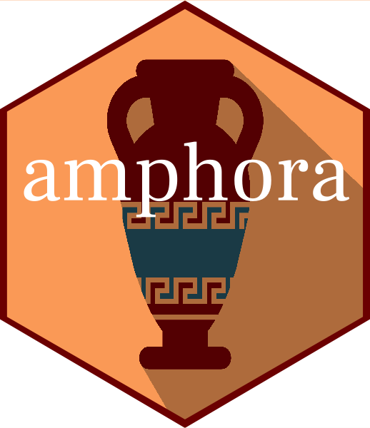

<!-- README.md is generated from README.Rmd. Please edit that file -->

```{r, include = FALSE}
knitr::opts_chunk$set(
  collapse = TRUE,
  comment = "#>",
  fig.path = "man/figures/README-",
  out.width = "100%"
)
```

# amphora R package  
<a href="https://www.vectorstock.com/royalty-free-vector/amphora-from-greece-in-flat-style-with-shadow-vector-20886871">Vector image by VectorStock / vectorstock</a>

<!-- badges: start -->
<!-- badges: end -->

Amphora is a package for reading, parsing, and authoring for knowledge 
representation in the clinical medicine domain. Wrappers to install 
[ROBOT](http://robot.obolibrary.org/) and use it for format conversions are also 
included. 

Related packages include [chariot](https://meerapatelmd.github.io/chariot) as
mentioned, and [mOMOP](https://meerapatelmd.github.io/mOMOP) which is used to 
create the OWL class hierarchy of the minimal oncology data elements in mCode.  


## Installation

``` r
# install.packages("devtools")
devtools::install_github("meerapatelmd/amphora")
```

## Code of Conduct

Please note that the amphora project is released with a [Contributor Code of Conduct](https://contributor-covenant.org/version/2/0/CODE_OF_CONDUCT.html). 
By contributing to this project, you agree to abide by its terms.
