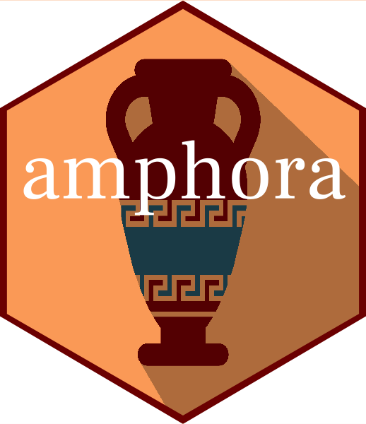

<!-- README.md is generated from README.Rmd. Please edit that file -->

# amphora R package 

<a href="https://www.vectorstock.com/royalty-free-vector/amphora-from-greece-in-flat-style-with-shadow-vector-20886871">Vector
image by VectorStock / vectorstock</a>

<!-- badges: start -->

<!-- badges: end -->

Amphora was inititally created to serve as an extension of the chariot R
package to create interactive Reingold-Tilford tree diagrams in D3.js.
It has now been extended to include the reading, parsing, and authoring
of hierarchies files for knowledge representation in the clinical
medicine domain. Wrappers to install
[ROBOT](http://robot.obolibrary.org/) and use it for format conversions
are also included.

Related packages include
[chariot](https://meerapatelmd.github.io/chariot) as mentioned, and
[mOMOP](https://meerapatelmd.github.io/mOMOP) which is used to create
the OWL class hierarchy of the minimal oncology data elements in mCode.

## Installation

``` r
# install.packages("devtools")
devtools::install_github("meerapatelmd/amphora")
```

## Code of Conduct

Please note that the amphora project is released with a [Contributor
Code of
Conduct](https://contributor-covenant.org/version/2/0/CODE_OF_CONDUCT.html).
By contributing to this project, you agree to abide by its terms.
